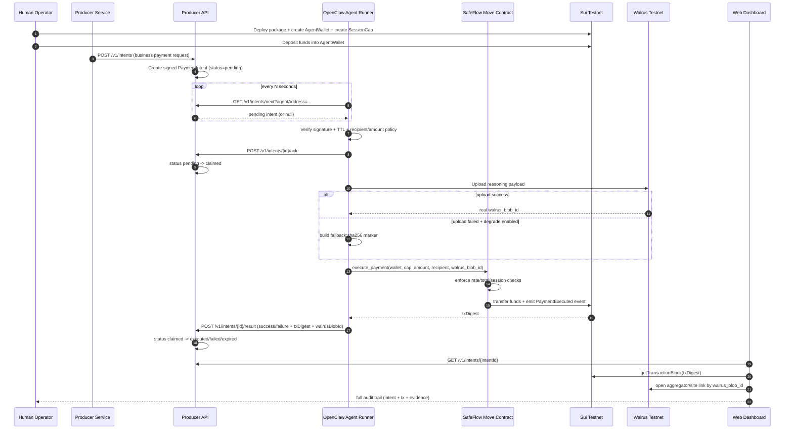
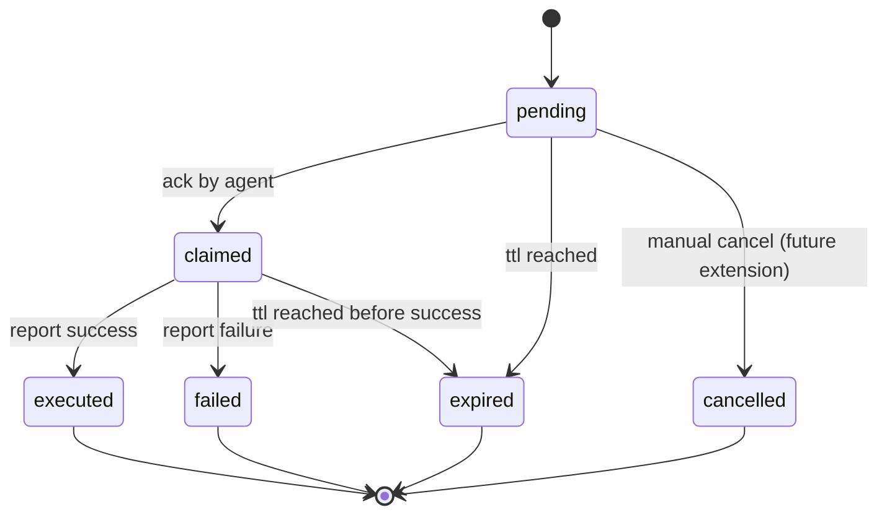

# SafeFlow Full E2E Role Flow

This document describes the full production-style flow and each role's responsibility in SafeFlow:

`Producer API + Agent Runner + SafeFlow Contract + Walrus + Human Dashboard`.

## Role Responsibilities

- **Human Operator**
  - Deploy contract, fund wallet, grant SessionCap, monitor status.
- **Producer Service**
  - Generates business payment request (`merchantOrderId`, amount, recipient, reason, expiry).
- **Producer API**
  - Signs `PaymentIntent`, stores state machine, exposes polling/ack/result APIs.
- **OpenClaw Agent Runner**
  - Polls intent, verifies signature/policy, executes on-chain payment, reports result.
- **SafeFlow Move Contract**
  - Enforces cap ownership, rate limits, total spend, and emits payment events.
- **Walrus**
  - Stores reasoning/audit payload and returns `walrus_blob_id` (or fallback marker when degraded).
- **Frontend Observer**
  - Displays intent status and links tx + Walrus evidence for human audit.

## OpenClaw Agent POV

From the OpenClaw runner's point of view, the lifecycle is deterministic and policy-driven:

1. Poll `Producer API` for one intent assigned to its `agentAddress`.
2. Verify intent signature and local policy constraints (TTL, recipient allowlist, max amount).
3. ACK the intent to move state `pending -> claimed`.
4. Execute payment via `executePaymentWithEvidence(...)`:
   - upload reasoning to Walrus when possible;
   - fallback to `fallback:<sha256>` only when degraded mode is enabled.
5. Report result (`success/failure`, `txDigest`, `walrusBlobId`) back to API.

The agent does **not** own treasury policy. It only executes within:
- off-chain intent constraints from producer service, and
- on-chain constraints from `SessionCap` + Move contract checks.

## End-to-End Sequence Diagram

## Intent State Machine

## What Is Verifiable by Humans

- Producer-side business intent (`intentId`, `merchantOrderId`, amount, recipient, status).
- On-chain execution (`txDigest`, event fields).
- Off-chain reasoning evidence (`walrus_blob_id` and linked content).
- Degraded mode signal (`walrus_blob_id` starts with `fallback:`).
