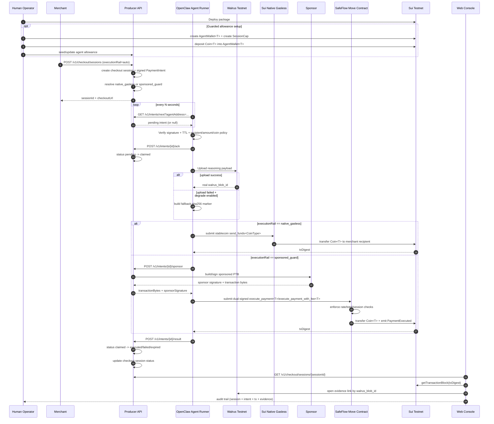
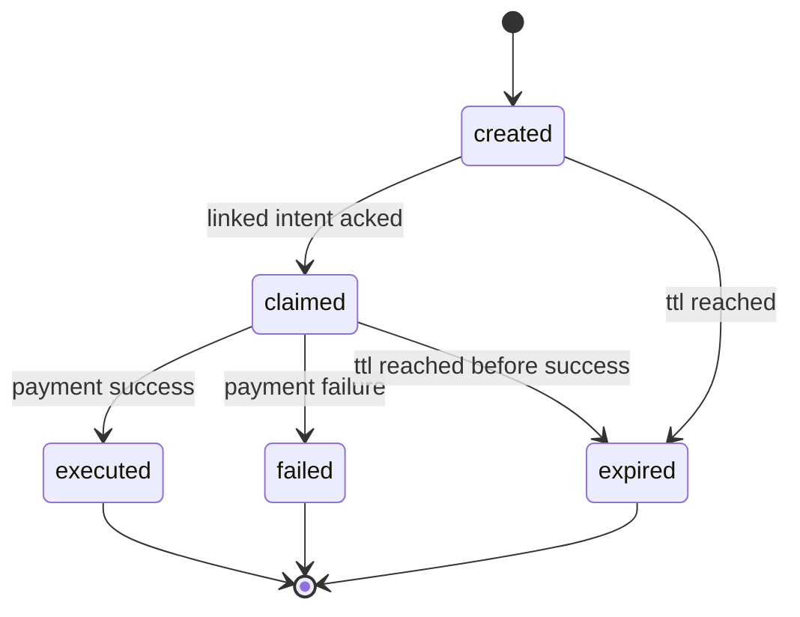
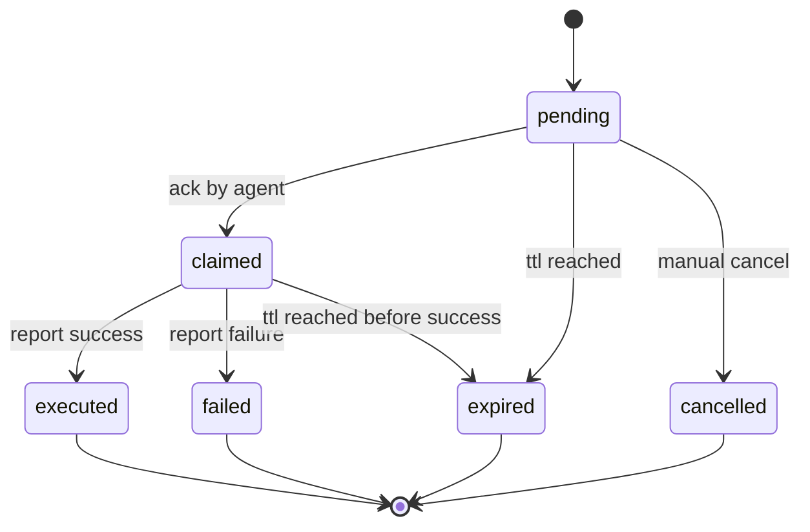

# SafeFlow Full E2E Role Flow

This document describes the current implementation flow:

`Merchant Checkout + Producer API + Agent Runner + Native Gasless / Sponsored Guard + Walrus + Web Console`.

## Role Responsibilities

- **Human Operator**
  - Deploy contract, configure Producer API, seed merchant/agent allowance, provision `AgentWallet<T>` and `SessionCap` when guarded flow is needed.
- **Merchant**
  - Creates checkout sessions and tracks order status.
- **Producer API**
  - Stores checkout sessions/payment intents in Postgres, signs intents, resolves `executionRail=auto`, validates sponsor requests, and records results.
- **OpenClaw Agent Runner**
  - Polls intent, verifies signature/policy, uploads Walrus evidence, executes the resolved rail, and reports result.
- **Sui Native Gasless**
  - Executes simple allowlisted stablecoin transfer without requiring agent SUI gas.
- **SafeFlow Move Contract**
  - Enforces `AgentWallet<T>` + `SessionCap` limits for guarded execution.
- **Sponsor**
  - Pays guarded execution gas and optionally receives stablecoin fee reimbursement.
- **Walrus**
  - Stores reasoning/audit payload and returns `walrus_blob_id` or fallback marker.
- **Web Console**
  - Shows operator setup, merchant checkout/status, public checkout, and audit trail.

## OpenClaw Agent POV

1. Poll `Producer API` for one intent assigned to its `agentAddress`.
2. Verify intent signature and local policy constraints (TTL, recipient allowlist, max amount, coin type).
3. ACK the intent to move state `pending -> claimed`.
4. Upload reasoning to Walrus or produce `fallback:<sha256>`.
5. Execute selected rail:
   - `native_gasless`: sign/submit native gasless stablecoin transfer.
   - `sponsored_guard`: request sponsor transaction bytes, sign the same bytes, submit with sponsor signature.
6. Report final status, `txDigest`, and `walrusBlobId` back to Producer API.

The agent does not own treasury policy. It executes within producer intent constraints and, for guarded payments, on-chain `SessionCap` constraints.

## End-to-End Sequence Diagram

```mermaid
sequenceDiagram
    autonumber
    participant Human as Human Operator
    participant Merchant as Merchant
    participant API as Producer API
    participant Agent as OpenClaw Agent Runner
    participant Walrus as Walrus Testnet
    participant Native as Sui Native Gasless
    participant Sponsor as Sponsor
    participant Contract as SafeFlow Move Contract
    participant Chain as Sui Testnet
    participant UI as Web Console

    Human->>Chain: Deploy package
    opt Guarded allowance setup
        Human->>Chain: create AgentWallet<T> + create SessionCap
        Human->>Chain: deposit Coin<T> into AgentWallet<T>
        Human->>API: seed/update agent allowance
    end

    Merchant->>API: POST /v1/checkout/sessions (executionRail=auto)
    API->>API: create checkout session + signed PaymentIntent
    API->>API: resolve native_gasless or sponsored_guard
    API-->>Merchant: sessionId + checkoutUrl

    loop every N seconds
        Agent->>API: GET /v1/intents/next?agentAddress=...
        API-->>Agent: pending intent (or null)
    end

    Agent->>Agent: Verify signature + TTL + recipient/amount/coin policy
    Agent->>API: POST /v1/intents/{id}/ack
    API->>API: status pending -> claimed

    Agent->>Walrus: Upload reasoning payload
    alt upload success
        Walrus-->>Agent: real walrus_blob_id
    else upload failed + degrade enabled
        Agent->>Agent: build fallback:sha256 marker
    end

    alt executionRail == native_gasless
        Agent->>Native: submit stablecoin send_funds<CoinType>
        Native->>Chain: transfer Coin<T> to merchant recipient
        Chain-->>Agent: txDigest
    else executionRail == sponsored_guard
        Agent->>API: POST /v1/intents/{id}/sponsor
        API->>Sponsor: build/sign sponsored PTB
        Sponsor-->>API: sponsor signature + transaction bytes
        API-->>Agent: transactionBytes + sponsorSignature
        Agent->>Contract: submit dual-signed execute_payment<T>/execute_payment_with_fee<T>
        Contract->>Contract: enforce rate/total/session checks
        Contract->>Chain: transfer Coin<T> + emit PaymentExecuted
        Chain-->>Agent: txDigest
    end

    Agent->>API: POST /v1/intents/{id}/result
    API->>API: status claimed -> executed/failed/expired
    API->>API: update checkout session status

    UI->>API: GET /v1/checkout/sessions/{sessionId}
    UI->>Chain: getTransactionBlock(txDigest)
    UI->>Walrus: open evidence link by walrus_blob_id
    UI-->>Human: audit trail (session + intent + tx + evidence)
```

## State Machines

Checkout sessions:

```mermaid
stateDiagram-v2
    [*] --> created
    created --> claimed: linked intent acked
    created --> expired: ttl reached
    claimed --> executed: payment success
    claimed --> failed: payment failure
    claimed --> expired: ttl reached before success
    executed --> [*]
    failed --> [*]
    expired --> [*]
```

Payment intents:

```mermaid
stateDiagram-v2
    [*] --> pending
    pending --> claimed: ack by agent
    pending --> expired: ttl reached
    claimed --> executed: report success
    claimed --> failed: report failure
    claimed --> expired: ttl reached before success
    pending --> cancelled: manual cancel
    executed --> [*]
    failed --> [*]
    expired --> [*]
    cancelled --> [*]
```

## What Is Verifiable by Humans

- Merchant order and checkout session (`sessionId`, `merchantOrderId`, amount, coin type, status).
- Resolved rail (`native_gasless` or `sponsored_guard`).
- On-chain execution (`txDigest`, and `PaymentExecuted` event for guarded rail).
- Walrus evidence (`walrus_blob_id` or explicit `fallback:` marker).
- Sponsor attempt status and fee fields for guarded rail.
