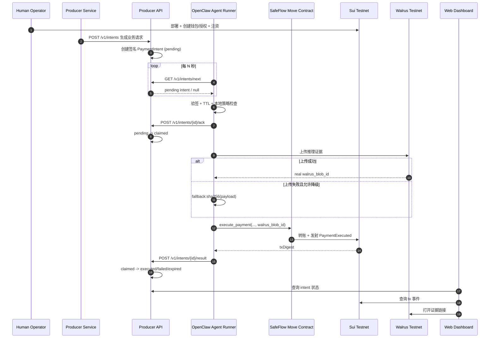
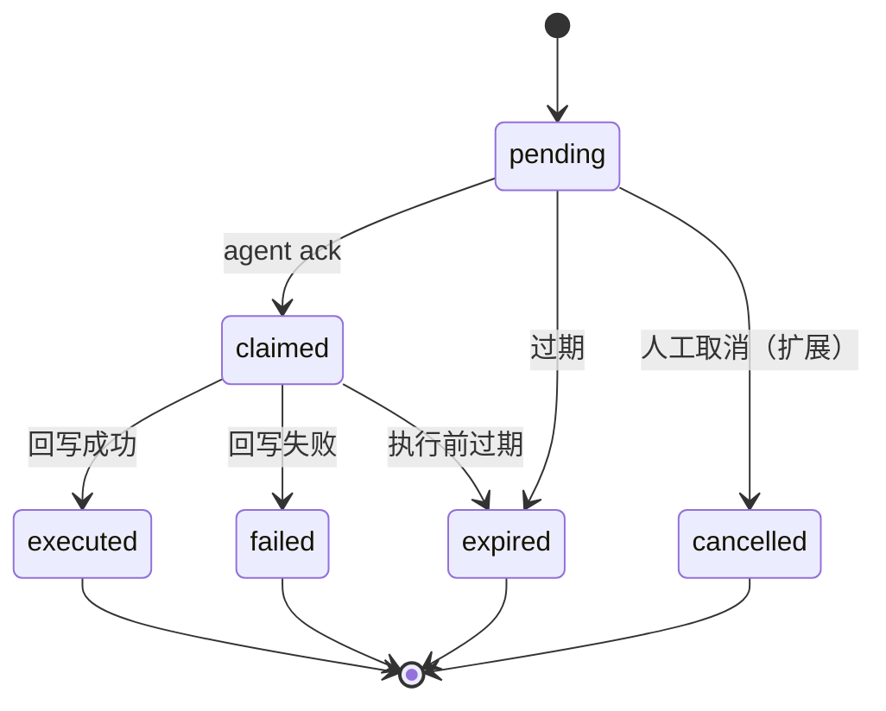

# SafeFlow 全链路 E2E 角色流程

本文描述 SafeFlow 在真实场景中的多角色职责与端到端流程：

`Producer API + Agent Runner + SafeFlow Contract + Walrus + Human Dashboard`。

## 角色职责

- **Human Operator（人类操作者）**
  - 部署合约、注资钱包、授权 SessionCap、监控状态。
- **Producer Service（业务服务）**
  - 产生业务支付请求（订单号、金额、收款方、原因、过期时间）。
- **Producer API（意图生产者）**
  - 签名 `PaymentIntent`，维护状态机，提供拉单/ACK/回写接口。
- **OpenClaw Agent Runner（执行者）**
  - 拉取意图、验签与本地策略检查、链上执行并回写结果。
- **SafeFlow Move Contract（链上约束）**
  - 校验授权关系、限速、总额约束，并发射支付事件。
- **Walrus（证据存储）**
  - 存储推理证据，返回 `walrus_blob_id`（或降级 fallback 标记）。
- **Frontend Observer（可视化观察）**
  - 展示意图状态、交易信息和证据链接，供人工审计。

## OpenClaw Agent 视角

从 Agent Runner 看，流程是可重复、可验证的执行循环：

1. 轮询拉取分配给 `agentAddress` 的 intent。
2. 验签 + TTL + 本地策略（收款白名单/金额上限）。
3. ACK 抢占执行权（`pending -> claimed`）。
4. 调用 `executePaymentWithEvidence(...)` 执行支付：
   - 正常上传 Walrus；
   - 若允许降级则记录 `fallback:<sha256>`。
5. 回写执行结果（`success/failure`、`txDigest`、`walrusBlobId`）。

Agent 不负责定义资金策略，仅在业务意图与链上约束范围内执行。

## 端到端时序图

## Intent 状态机

