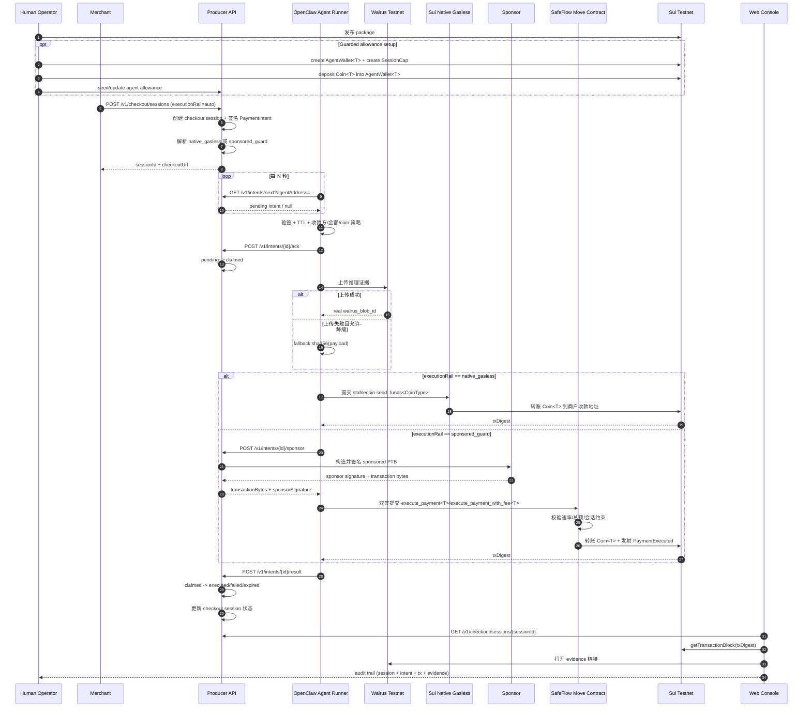
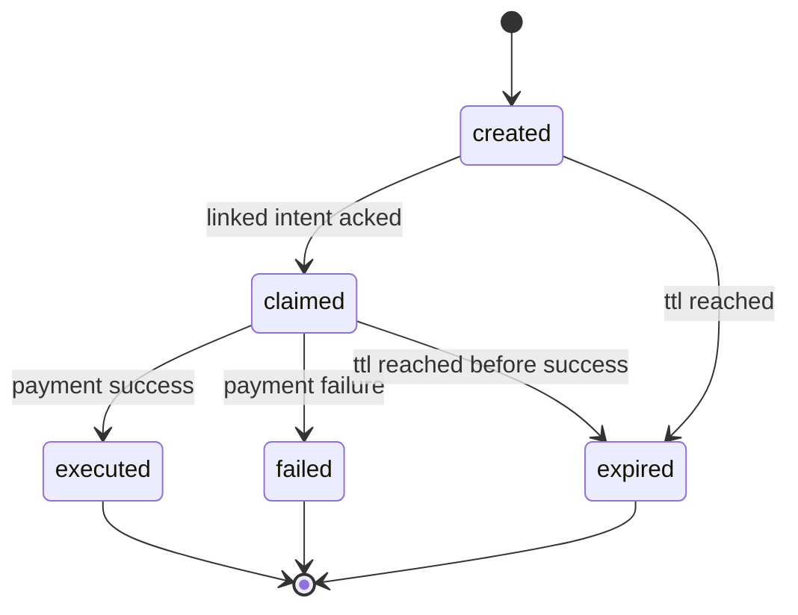
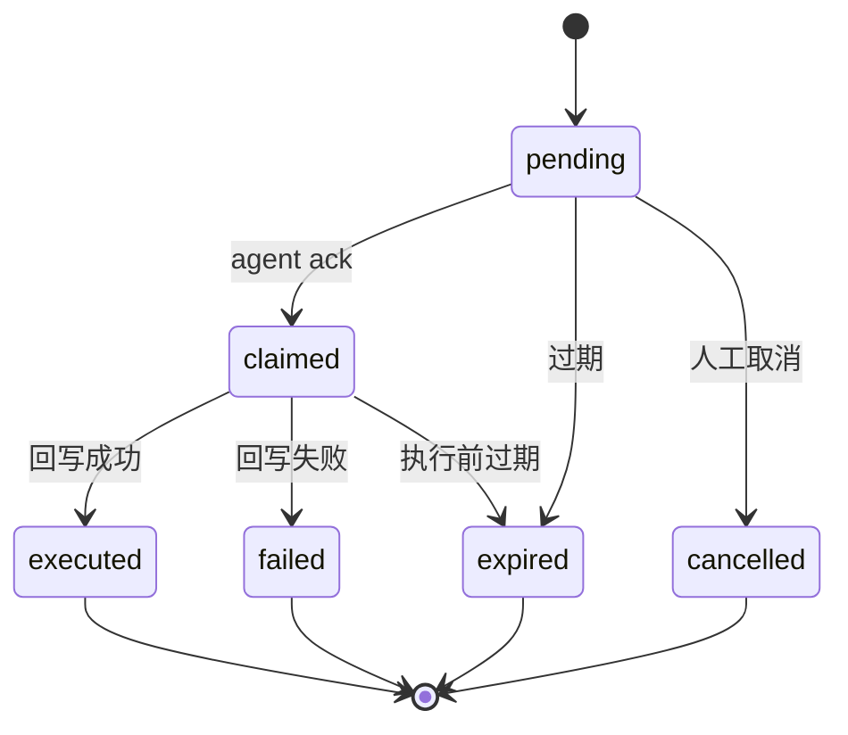

# SafeFlow 全链路 E2E 角色流程

本文描述当前实现的真实流程：

`Merchant Checkout + Producer API + Agent Runner + Native Gasless / Sponsored Guard + Walrus + Web Console`。

## 角色职责

- **Human Operator（人类操作者）**
  - 部署合约、配置 Producer API、seed merchant/agent allowance；需要 guarded flow 时创建 `AgentWallet<T>` 与 `SessionCap`。
- **Merchant（商户）**
  - 创建 checkout session，并跟踪订单状态。
- **Producer API**
  - 用 Postgres 存储 checkout session/payment intent，签名 intent，解析 `executionRail=auto`，校验 sponsor 请求并记录结果。
- **OpenClaw Agent Runner**
  - 拉取 intent、验签与本地策略检查、上传 Walrus evidence、执行解析后的 rail，并回写结果。
- **Sui Native Gasless**
  - 执行简单 allowlisted stablecoin 转账，Agent 不需要 SUI gas。
- **SafeFlow Move Contract**
  - 在 guarded flow 中执行 `AgentWallet<T>` + `SessionCap` 限额、总额与过期约束。
- **Sponsor**
  - 为 guarded execution 支付 gas，并可收取同稳定币的 sponsor fee reimbursement。
- **Walrus**
  - 存储推理证据，返回 `walrus_blob_id` 或 fallback marker。
- **Web Console**
  - 展示 operator setup、merchant checkout/status、public checkout 和 audit trail。

## OpenClaw Agent 视角

1. 轮询拉取分配给 `agentAddress` 的 intent。
2. 验签 + TTL + 本地策略（收款白名单、单笔金额、coin type）。
3. ACK 抢占执行权（`pending -> claimed`）。
4. 上传 Walrus evidence 或生成 `fallback:<sha256>`。
5. 根据解析后的 rail 执行：
   - `native_gasless`：签名/提交 native gasless stablecoin transfer。
   - `sponsored_guard`：请求 sponsor transaction bytes，对同一 bytes 签名后与 sponsor signature 一起提交。
6. 回写最终状态、`txDigest` 与 `walrusBlobId`。

Agent 不负责定义资金策略；它只在 producer intent 约束和 guarded flow 的链上 `SessionCap` 约束内执行。

## 端到端时序图

```mermaid
sequenceDiagram
    autonumber
    participant Human as Human Operator
    participant Merchant as Merchant
    participant API as Producer API
    participant Agent as OpenClaw Agent Runner
    participant Walrus as Walrus Testnet
    participant Native as Sui Native Gasless
    participant Sponsor as Sponsor
    participant Contract as SafeFlow Move Contract
    participant Chain as Sui Testnet
    participant UI as Web Console

    Human->>Chain: 发布 package
    opt Guarded allowance setup
        Human->>Chain: create AgentWallet<T> + create SessionCap
        Human->>Chain: deposit Coin<T> into AgentWallet<T>
        Human->>API: seed/update agent allowance
    end

    Merchant->>API: POST /v1/checkout/sessions (executionRail=auto)
    API->>API: 创建 checkout session + 签名 PaymentIntent
    API->>API: 解析 native_gasless 或 sponsored_guard
    API-->>Merchant: sessionId + checkoutUrl

    loop 每 N 秒
        Agent->>API: GET /v1/intents/next?agentAddress=...
        API-->>Agent: pending intent / null
    end

    Agent->>Agent: 验签 + TTL + 收款方/金额/coin 策略
    Agent->>API: POST /v1/intents/{id}/ack
    API->>API: pending -> claimed

    Agent->>Walrus: 上传推理证据
    alt 上传成功
        Walrus-->>Agent: real walrus_blob_id
    else 上传失败且允许降级
        Agent->>Agent: fallback:sha256(payload)
    end

    alt executionRail == native_gasless
        Agent->>Native: 提交 stablecoin send_funds<CoinType>
        Native->>Chain: 转账 Coin<T> 到商户收款地址
        Chain-->>Agent: txDigest
    else executionRail == sponsored_guard
        Agent->>API: POST /v1/intents/{id}/sponsor
        API->>Sponsor: 构造并签名 sponsored PTB
        Sponsor-->>API: sponsor signature + transaction bytes
        API-->>Agent: transactionBytes + sponsorSignature
        Agent->>Contract: 双签提交 execute_payment<T>/execute_payment_with_fee<T>
        Contract->>Contract: 校验速率/总额/会话约束
        Contract->>Chain: 转账 Coin<T> + 发射 PaymentExecuted
        Chain-->>Agent: txDigest
    end

    Agent->>API: POST /v1/intents/{id}/result
    API->>API: claimed -> executed/failed/expired
    API->>API: 更新 checkout session 状态

    UI->>API: GET /v1/checkout/sessions/{sessionId}
    UI->>Chain: getTransactionBlock(txDigest)
    UI->>Walrus: 打开 evidence 链接
    UI-->>Human: audit trail (session + intent + tx + evidence)
```

## 状态机

Checkout session：

```mermaid
stateDiagram-v2
    [*] --> created
    created --> claimed: linked intent acked
    created --> expired: ttl reached
    claimed --> executed: payment success
    claimed --> failed: payment failure
    claimed --> expired: ttl reached before success
    executed --> [*]
    failed --> [*]
    expired --> [*]
```

Payment intent：

```mermaid
stateDiagram-v2
    [*] --> pending
    pending --> claimed: agent ack
    pending --> expired: 过期
    claimed --> executed: 回写成功
    claimed --> failed: 回写失败
    claimed --> expired: 执行前过期
    pending --> cancelled: 人工取消
    executed --> [*]
    failed --> [*]
    expired --> [*]
    cancelled --> [*]
```

## 人类可以验证什么

- 商户订单和 checkout session（`sessionId`、`merchantOrderId`、金额、coin type、状态）。
- 最终解析的 rail（`native_gasless` 或 `sponsored_guard`）。
- 链上执行（`txDigest`；guarded rail 还有 `PaymentExecuted` 事件）。
- Walrus evidence（真实 `walrus_blob_id` 或明确的 `fallback:` 标记）。
- Guarded rail 的 sponsor attempt 状态与 fee 字段。
