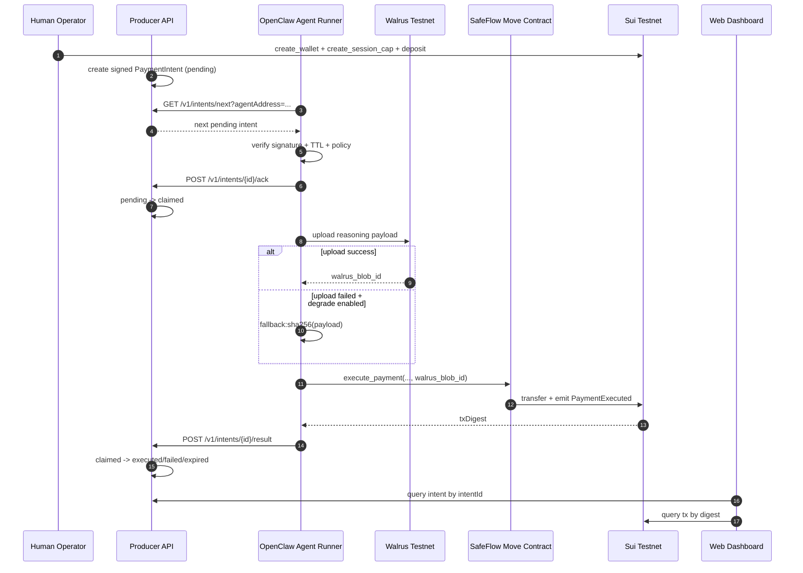

# SafeFlow on Sui

## Agent Wallet Air-Gap for OpenClaw

- Track focus: **Track 1 - Safety & Security**
- Optional extension: **Track 2 - Local God Mode**
- Stack: `Sui Move` + `Walrus` + `TypeScript SDK` + `Next.js Dashboard`

---

## Problem

OpenClaw agents can execute local commands and browser actions with high privilege.

If a hot wallet key is exposed to agent runtime:

- Prompt injection can drain funds quickly
- Humans cannot inspect why each payment happened
- Recovery is usually after-loss, not pre-loss

**Goal:** keep agent useful for autonomous payment, while bounding worst-case loss.

---

## Core Idea

`Fund custody` and `execution permission` must be separated.

- Human funds stay in on-chain `AgentWallet` (shared object)
- Agent only receives a scoped `SessionCap` (owned object)
- Contract enforces:
  - `max_spend_per_second`
  - `max_spend_total`
  - `expires_at_ms`
- Every payment carries `walrus_blob_id` for post-incident audit trail

This is the wallet air-gap pattern on Sui object model.

---

## Architecture

```text
┌──────────────┐      create_wallet/cap      ┌───────────────────────────┐
│ Human Wallet │ ───────────────────────────► │ Sui: AgentWallet (shared) │
└──────────────┘                              └──────────────┬────────────┘
                                                             │
                                        transfer SessionCap  │
                                                             ▼
                                                   ┌──────────────────┐
                                                   │ Agent (OpenClaw) │
                                                   │ local key only   │
                                                   └─────────┬────────┘
                                                             │
                                     upload reasoning proof  │
                                                             ▼
                                                   ┌──────────────────┐
                                                   │ Walrus / Seal    │
                                                   └─────────┬────────┘
                                                             │ blob id
                                                             ▼
                                          execute_payment(wallet, cap, ...)
                                                             │
                                                             ▼
                                                   ┌──────────────────┐
                                                   │ Recipient/Service│
                                                   └──────────────────┘
```

---

## Full E2E Role Flow (Mermaid)



---

## Security Model (Track 1)

1. **Key isolation**
   - Agent never holds the human treasury private key.
2. **Bounded damage**
   - Rate + total + expiry limits enforced in Move.
3. **Auditability**
   - Payment event includes Walrus blob reference.
4. **Human oversight**
   - Dashboard provisions allowance, not full control transfer.

Expected outcome: injection can trigger actions, but cannot bypass on-chain limits.

---

## Demo Storyline (3-4 min)

1. Build/test contract (`sui move test`)
2. Human connects dashboard, creates `walletId` + `sessionCapId`
3. Simulate malicious request:
   - agent tries oversized/too-fast payment
   - transaction rejected by contract rules
4. Legitimate small payment succeeds
5. Show on-chain event and attached `walrus_blob_id`

Narrative: **"Allowed autonomy, denied abuse."**

---

## Why Sui

- Object-centric capability model fits `SessionCap` naturally
- PTB supports composable agent operations
- Low-latency + low-fee micro payment flow
- Walrus gives decentralized reasoning evidence channel

Compared with account-abstraction-heavy approaches, implementation is simpler and safer by construction.

---

## Track Mapping

### Track 1 (Primary)

- Wallet air-gap
- Prompt-injection blast-radius control
- Auditable payment intent trail

### Track 2 (Secondary Narrative)

- Local always-on agent can pay for services autonomously
- Human sets policy once; agent operates within budget envelope

One codebase, two narratives; strongest scoring path remains Track 1.

---

## Current Implementation Status

- `agent_wallet/sources/wallet.move`
  - `create_wallet`, `deposit`, `create_session_cap`, `execute_payment`
- `agent_wallet/tests/wallet_tests.move`
  - unit test passes
- `agent_scripts/index.ts`
  - local key + SDK skill bootstrap
- `web/src/app/page.tsx`
  - human provisioning dashboard

Demo is already runnable end-to-end in testnet setup.

---

## Next Hardening (Post-Hackathon)

- Add explicit `pause/revoke SessionCap`
- Add stronger validation rules for `walrus_blob_id`
- Encrypt agent local key storage
- Add `SECURITY.md` threat model + incident playbook
- Add monitoring/alerting for abnormal spending behavior

---

## Closing

**SafeFlow makes autonomous agents economically useful without surrendering wallet safety.**

- Secure by contract constraints
- Transparent by audit traces
- Practical for OpenClaw-style local operators

### Contact / Repo

`SafeFlow on Sui (OpenClaw Agent Air-Gap Wallet)`
