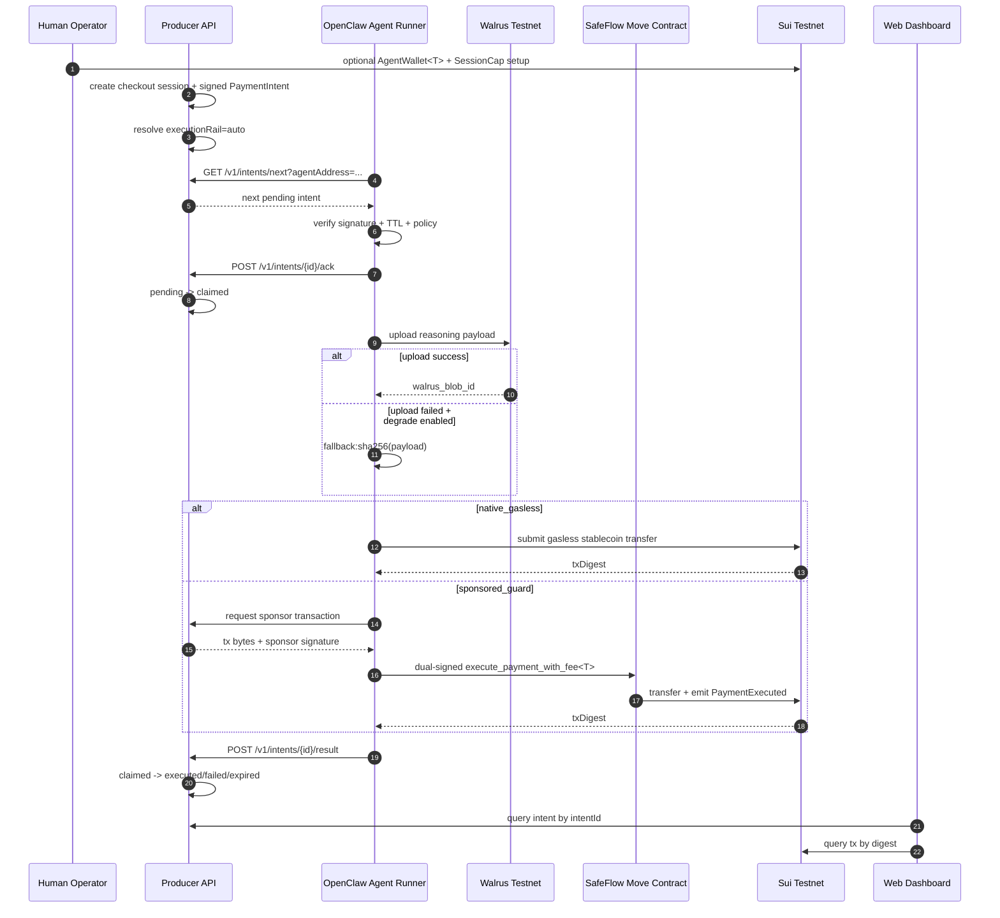

# SafeFlow on Sui

## Gasless Checkout + AgentPay Guard for OpenClaw

- Track focus: **Track 1 - Safety & Security**
- Optional extension: **Track 2 - Local God Mode**
- Stack: `Sui native gasless` + `Sui Move` + `Walrus` + `Producer API` + `Next.js Console`

## Problem

OpenClaw agents can execute local commands and browser actions with high privilege.

If a hot wallet key is exposed to agent runtime:

- Prompt injection can drain funds quickly
- Humans cannot inspect why each payment happened
- Recovery is usually after-loss, not pre-loss

**Goal:** keep agent useful for autonomous payment, while bounding worst-case loss.


## Core Idea

Simple payments and guarded agent spend should use different rails.

- `native_gasless`: allowlisted stablecoin checkout, no agent SUI gas
- `sponsored_guard`: `AgentWallet<T>` + `SessionCap` when limits are required
- Producer API resolves `executionRail=auto`
- Every execution reports `txDigest` + `walrus_blob_id`

This is automatic least-privilege routing for agent payments.


## Architecture

```text
┌──────────────┐     checkout session      ┌─────────────────────┐
│ Merchant     │ ────────────────────────► │ Producer API        │
└──────────────┘                           │ executionRail=auto  │
                                           └──────────┬──────────┘
                                                      │
                                      ┌───────────────┴───────────────┐
                                      │                               │
                                      ▼                               ▼
                           ┌──────────────────┐          ┌────────────────────┐
                           │ native_gasless   │          │ sponsored_guard    │
                           │ stablecoin send  │          │ AgentWallet+Cap    │
                           └────────┬─────────┘          └─────────┬──────────┘
                                    │                              │
                                    └──────────┬───────────────────┘
                                               ▼
                                   ┌──────────────────────┐
                                   │ Merchant / evidence  │
                                   │ txDigest + Walrus    │
                                   └──────────────────────┘
```


## Full E2E Role Flow (Mermaid)


```mermaid
sequenceDiagram
    autonumber
    participant Human as Human Operator
    participant API as Producer API
    participant Agent as OpenClaw Agent Runner
    participant Walrus as Walrus Testnet
    participant Contract as SafeFlow Move Contract
    participant Chain as Sui Testnet
    participant UI as Web Dashboard

    Human->>Chain: optional AgentWallet<T> + SessionCap setup
    API->>API: create checkout session + signed PaymentIntent
    API->>API: resolve executionRail=auto
    Agent->>API: GET /v1/intents/next?agentAddress=...
    API-->>Agent: next pending intent
    Agent->>Agent: verify signature + TTL + policy
    Agent->>API: POST /v1/intents/{id}/ack
    API->>API: pending -> claimed

    Agent->>Walrus: upload reasoning payload
    alt upload success
        Walrus-->>Agent: walrus_blob_id
    else upload failed + degrade enabled
        Agent->>Agent: fallback:sha256(payload)
    end

    alt native_gasless
      Agent->>Chain: submit gasless stablecoin transfer
      Chain-->>Agent: txDigest
    else sponsored_guard
      Agent->>API: request sponsor transaction
      API-->>Agent: tx bytes + sponsor signature
      Agent->>Contract: dual-signed execute_payment_with_fee<T>
      Contract->>Chain: transfer + emit PaymentExecuted
      Chain-->>Agent: txDigest
    end
    Agent->>API: POST /v1/intents/{id}/result
    API->>API: claimed -> executed/failed/expired
    UI->>API: query intent by intentId
    UI->>Chain: query tx by digest
```

## Security Model (Track 1)

1. **Key isolation**
   - Agent never holds the human treasury private key.
2. **Automatic rail choice**
   - Simple stablecoin checkout uses native gasless.
   - Guarded spend uses rate + total + expiry limits in Move.
3. **Auditability**
   - Checkout audit trail includes Walrus blob reference.
4. **Human oversight**
   - Dashboard provisions allowance only when Guard is needed.

Expected outcome: injection can trigger actions, but cannot bypass on-chain limits.

## Demo Storyline (3-4 min)

1. Create checkout session with `executionRail=auto`
2. Show simple USDC payment resolving to native gasless
3. Create guarded checkout with `requiresGuard=true`
4. Simulate malicious request:
   - agent tries oversized/too-fast payment
   - transaction rejected by contract rules
5. Legitimate guarded payment succeeds
6. Show tx digest and attached `walrus_blob_id`

Narrative: **"Allowed autonomy, denied abuse."**

## Why Sui

- Object-centric capability model fits `SessionCap` naturally
- PTB supports composable agent operations
- Low-latency + low-fee micro payment flow
- Walrus gives decentralized reasoning evidence channel

Compared with account-abstraction-heavy approaches, implementation is simpler and safer by construction.

## Current Implementation Status

- `agent_wallet/sources/wallet.move`
  - `create_wallet`, `deposit`, `create_session_cap`, `execute_payment`, `execute_payment_with_fee`
- `agent_wallet/tests/wallet_tests.move`
  - generic coin, limit, expiry, insufficient balance coverage
- `producer_api/server.mjs`
  - checkout, intent, sponsor, Postgres migrations
- `agent_scripts/e2e_runner.ts`
  - auto rail execution
- `web/src/app/page.tsx`
  - demo console + public checkout

Demo is runnable end-to-end in testnet setup.

## Closing

**SafeFlow makes autonomous agents economically useful without surrendering wallet safety.**

- Secure by contract constraints
- Transparent by audit traces
- Practical for OpenClaw-style local operators
